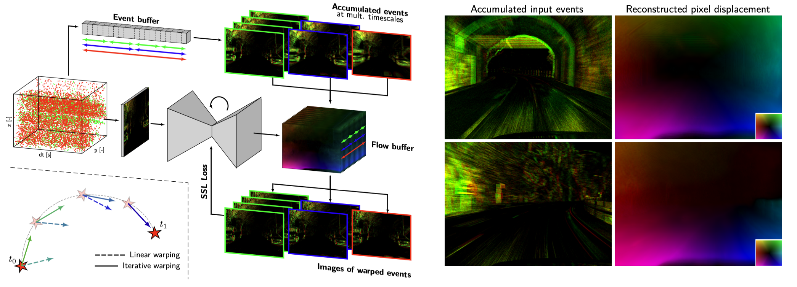

# Taming Contrast Maximization for Learning Sequential Event-based Optical Flow Estimation

Work accepted at ICCV'23 [[paper](https://arxiv.org/abs/2303.05214), [video](https://youtu.be/vkYimENc494)].

If you use this code in an academic context, please cite our work:

```bibtex
@InProceedings{Paredes-Valles_2023_ICCV,
    author    = {Paredes-Vall\'es, Federico and Scheper, Kirk Y. W. and De Wagter, Christophe and de Croon, Guido C. H. E.},
    title     = {Taming Contrast Maximization for Learning Sequential, Low-latency, Event-based Optical Flow},
    booktitle = {Proceedings of the IEEE/CVF International Conference on Computer Vision (ICCV)},
    month     = {October},
    year      = {2023},
    pages     = {9695-9705}
}

```

This code allows for the reproduction of the experiments leading to the results in Section 4.2.



----------

## Usage

----------

This project uses Python >= 3.7.3 and we strongly recommend the use of virtual environments. If you don't have an environment manager yet, we recommend `pyenv`. It can be installed via:

```
curl https://pyenv.run | bash
```

Make sure your `~/.bashrc` or `~/.zshrc` file contains the following:

```
export PATH="$HOME/.pyenv/bin:$PATH"
eval "$(pyenv init -)"
eval "$(pyenv virtualenv-init -)"
```

After that, restart your terminal and run:

```
pyenv update
```

To set up your environment with `pyenv` first install the required python distribution and make sure the installation is successful (i.e., no errors nor warnings):

```
pyenv install -v 3.7.3
```

Once this is done, set up the environment and install the required libraries:

```
pyenv virtualenv 3.7.3 taming_flow
pyenv activate taming_flow

pip install --upgrade pip==20.0.2

cd taming_flow/
```

To install our dependencies:

```
pip install -r requirements.txt
```

### Download datasets

The following is a list of the datasets that are required to train/evaluate our models on the DSEC-Flow and MVSEC datasets:

- **dsec_train** (1.98 GB): 128x128 random crops of the training partition of DSEC-Flow. Each sequence is two seconds of duration. Used for training.
- **dsec_benchmark_aug** (15.94 GB): 480x640 test partition of DSEC-Flow. Used for evaluation.
- **mvsec_eval** (653.5 MB): 260x346 outdoot_day_1 sequence, from seconds 222.4 to 240.4. Used for evaluation.

The datasets can be downloaded from [here](https://1drv.ms/u/s!Ah0kx0CRKrAZjxMxBx4z5HN1CjWv?e=UiayaL) and are expected at: `../datasets/`.

### Download models

The pretrained models can be downloaded from [here](https://1drv.ms/u/s!Ah0kx0CRKrAZjxSwx8-UTUAncgg3?e=yM2g0i), and are expected at `mlruns/`.

In this project we use MLflow to keep track of the experiments. To visualize the models tht are available, alongside other useful details and evaluation metrics, run the following from the home directory of the project:

```
mlflow ui
```

We provide our best performing models in the DSEC and MVSEC datasets.

----------

## Inference

----------

To estimate optical flow from event sequences from a dataset of your choice, adjust `config/eval_flow.yml` according to your needs and run:

```
python eval_flow.py <model_name>

# for example:
python eval_flow.py dsec_model
```

where `<model_name>` is the name of MLflow run to be evaluated. Note that, if a run does not have a name (this would be the case for your own trained models), you can evaluated it through its run ID (also visible through MLflow).

### MVSEC

Simply run:

```
python eval_flow.py <model_name> --config configs/eval_mvsec.yml
```

### DSEC-Flow Public Benchmark
If what you want to is to generate a submission to the [DSEC-Flow Optical Flow Public Benchmark](https://dsec.ifi.uzh.ch/uzh/dsec-flow-optical-flow-benchmark/), run:

```
python eval_flow.py <model_name> --config configs/eval_dsec.yml
mkdir results_inference/<model_name>
cp -r results_inference/<model_name>/results/eval_* results_inference/<model_name>/
python prepare_dsec_submission.py <model_name> --eval_id <eval_id>
```

This will generate a `submission/` folder in the directory with your results. Zip it and submit!

The DSEC submission associated to our best performing model can be downloaded for inspection from [here](https://1drv.ms/u/s!Ah0kx0CRKrAZjyfkk6kgwMKgxar_?e=njw0KT).

----------

## Training

----------

Run:

```
python train_flow.py
```

to train an traditional artificial neural network. In `configs/`, you can find the configuration files and vary the training settings (e.g., input settings, model, event warping, activate/deactivate visualization). For other models available, see `models/model.py`. 

**Note that we used a batch size of 8 in our experiments. Depending on your computational resources, you may need to lower this number.**

During and after the training, information about your run can be visualized through [MLflow](https://www.mlflow.org/docs/latest/index.html#) and [TensorBoard](https://www.tensorflow.org/tensorboard).

----------

## Uninstalling pyenv

----------

Once you finish using our code, you can uninstall `pyenv` from your system by:

1. Removing the `pyenv` configuration lines from your `~/.bashrc`.
2. Removing its root directory. This will delete all Python versions that were installed under the `$HOME/.pyenv/versions/` directory:

```
rm -rf $HOME/.pyenv/
```
